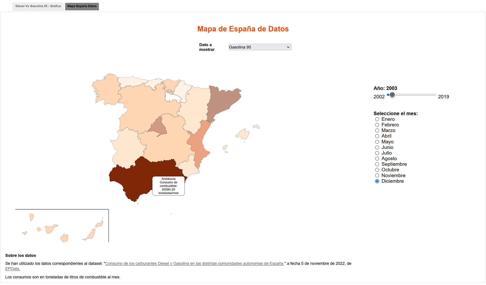

#### Curso 2022/2023 - DISEÑO Y EVALUACICÓN DE SISTEMAS INTERACTIVOS  
#### Autor: Javier Abad Hernández

# Consumos y precios del combustible en España.
Ante la tendencia actual sobre la subida de los precios y el cada vez más doloroso pago de los precios de los combustibles, en la que mucha gente se ve afectada, he decidido realizar una representación gráfica de los precios que ha tenido tanto la Gasolina 95 como el Diesel a lo largo de los años hasta la actualidad para así poder buscar algún tipo de tendencias de precios entre ellos y también la representación del consumo de cada uno de ellos por las distintas comunidades autónomas, aunque en este caso solo hasta 2019. 

# Datos.
Para la visualización, se han han utilizado los datos correspondientes al dataset: "<a href="https://www.epdata.es/datos/precio-gasolina-gasoleo-diesel-espana-cifras-datos-estadisticas/420">Comparación precios de Diesel y Gasolina 95 en España </a>" actualizados a fecha 7 de diciembre de 2022, de <a href="https://www.epdata.es/datos/"> EPData.</a> y "<a href="https://www.epdata.es/datos/consumo-carburantes-gasolina-gasoleo-espana-estadisticas-datos/326/espana/106">Consumo de los carburantes Diesel y Gasolina en las distintas comunidades autonomas de España </a>" a fecha 5 de noviembre de 2022, de <a href="https://www.epdata.es/datos/"> EPData.</a>

# Visualización.
El proyecto de visualización realmente no va a ser “único”, se va a subdividir en “dos visualizaciones” separadas por pestañas. 

En la primera pestaña se verá la evolución de precio de los dos combustibles de manera anual en año seleccionado. Sera representado con líneas de diferente color (linechart), el usuario podrá seleccionar el año a representar mediante un slider vertical y tambien se ha implementado mediante botones de "play", "pause" y "stop", la posibilidad de un aumento automatico de cada año por cada 4 segundos.

En la segunda, se mostrará un mapa iterativo de España con la cantidad de combustible en toneladas de litros por mes. Se utilizará un choropleth map para representar estos datos, el usuario mediante un menu desplegable podrá elegir el combustible preferido, mediante un slider horizontal podra elegir de que año desea visualizar los datos y mediante radio buttons el usuario podrá elegir que mes del año seleccionado quiere representar. 

Se ha implementado un modo oscuro, que representa tonalidades grises oscuras para una menos afectación a la vista, se ha elegido esta tonalidad ya que pese a que afecta negativamente en algún aspecto a la percepción, no lo hace de una forma tan agresiva como si los tonos fueran realmente negros.
